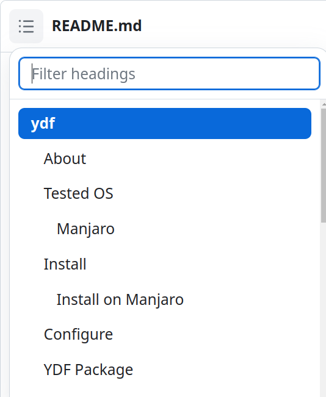

<!-- DO NOT EDIT THIS FILE; IT WAS GENERATED BY ./tools/update-readme -->
<!-- EDIT README.md.tpl INSTEAD -->
# ydf

A disruptive dotfiles manager and more.

## Table of Contents

Click on the menu right before `README.md` as shown in the image below.



## About

Are you tired of dealing with dotfiles of tools you are not using, are you tired
of installing a bunch of messy, dirty, and unnecessary configs and executing an
elephant script.

This solution brings you a simple way to declare and install the tools you need along
with its configurations, following the principles of high cohesion and low coupling.
Turn the chaos to order, if you install the configuration, you install the tool
because those belong to the same `package`.

With this solution you can create multiple selections of packages for your different
needs, for example, you can create a `packages selection` for your laptop, desktop,
servers, different operating systems, etc.

Declaring your working environment give you some benefits: transparency and control
over it, allowing you to easily reproduce it on a new machine or fresh OS, you can
share it with others, so they can reproduce your working environment, you can
versioning it with git.

> What you write you can read, share, save and reproduce, it is simply there, it exists.

## Tested OS

It's tested on the following OS:

### Manjaro

Runtime Dependencies:

```sh
# SYSTEM: Linux yuniel-pc 6.1.53-1-MANJARO #1 SMP PREEMPT_DYNAMIC Wed Sep 13 14:10:57 UTC 2023 x86_64 GNU/Linux
# PACMAN
bash 5.1.016-3
```

Optional Dependencies:

```sh
# SYSTEM: Linux yuniel-pc 6.1.53-1-MANJARO #1 SMP PREEMPT_DYNAMIC Wed Sep 13 14:10:57 UTC 2023 x86_64 GNU/Linux
# PACMAN
yay 12.1.3-1
snapd 2.60.3-1
docker 1:24.0.5-1
docker-compose 2.20.3-1
# GITHUB
yunielrc/yzsh
```

⚠️ It should work on any other linux distribution, but it has not been tested.

## Install

Clone the repository and switch to ydf directory

```sh
git clone https://github.com/yunielrc/ydf.git && cd ydf
```

### Install on Manjaro

Install optional dependencies and ydf on home directory

```sh
make install-opt-manjaro && make install-tohome
```

Minimal installation without optional dependencies:

```sh
make install-tohome
```

⚠️ Attention: Instructions that rely on optional dependencies can't be used
   with the minimal installation.

Instruction | Optional dependency
---------|----------
 `@snap` | snapd
 `docker-compose.yml` | docker, docker-compose
 `@yay` | yay
 `*.plugin.zsh` | yzsh

### Other linux Distros

For any other linux distribution you can install optional dependencies manually,
then execute the command below:

```sh
make install-tohome
```

## Configure

Edit the config file:

- If your distro is manjaro set the variable `YDF_PACKAGE_SERVICE_DEFAULT_OS` to
manjaro. If you have any other distro don't set this variable.

```sh
vim ~/.ydf.env
```

## YDF Package

### What is a package?

A `package` is a directory containing files and directories in which some have
a special meaning for the `interpreter`. ydf is an `interpreter`.

### Which are the directories and files with special meaning?

Here is an example of a `package` with 19 directories and files with special
meaning, those are `instructions` that work on any linux distribution:

```sh
package1
├── preinstall           # Script executed before all instructions
├── @flatpak             # Install <package1> with flatpak
├── @snap                # Install <package1> with snap
├── install              # Script executed on install
├── docker-compose.yml   # Run docker compose up -d
├── package1.plugin.zsh  # Install yzsh plugin
├── package1.theme.zsh   # Install yzsh theme
├── homeln/              # Create symlinks on home for the first level files and
|                        # directories inside this directory
├── homelnr/             # Create symlinks on home for all files inside this
|                        # directory
├── homecp/              # Copy all files to home directory
├── rootcp/              # Copy all files to root directory
├── homecat/             # Concatenate all files with those existing in home
├── rootcat/             # Concatenate all files with those existing in root
├── homecps/             # Evaluate variables in files and copy them to home
├── rootcps/             # Evaluate variables in files and copy them to root
├── homecats/            # Evaluate variables in files and concatenates them with
|                        # those existing in home
├── rootcats/            # Evaluate variables in files and concatenates them with
|                        # those existing in root
├── dconf.ini            # Load dconf settings
└── postinstall          # Script executed after all instructions
```

The `instructions` can be grouped in 4 categories:

- Scripts instructions: `preinstall`, `install`, `postinstall`.
These instructions are shell scripts that are executed by bash.

- Package manager instructions: `@flatpak`, `@snap`.
These instrucions are plain text files, the file can have inside one or more package
names that are going to be installed. The file can be empty, in this case the package
`package1` is going to be installed.

- Directory instructions: `homeln`, `homelnr`, `homecp`, `rootcp`, `homecat`,
`rootcat`, `homecps`, `rootcps`, `homecats`, `rootcats`.
These instructions are directories that contains files that are going to be
symlinked, copied or concatenated to the home or root directory. For those
that end with `s` all the variables inside each file are substituted with the
values defined in the `envsubst.env` file that is inside the `packages directory`.

- Tool files instructions: `docker-compose.yml`, `dconf.ini`, `package1.plugin.zsh`,
`package1.theme.zsh`.
These instructions are files that are going to be used by a tool. For example
`docker-compose.yml` is going to be used by docker compose.
The `package1.plugin.zsh` is a plugin that is going to be installed inside the
YZSH data directory and used by YZSH.

There are 2 more `instructions` that only work for manjaro linux:

```sh
package2
├── @pacman
└── @yay
```

👉 If you want support for others package managers you can open an issue or
create a pull request.

You can check out some examples of `packages` at: `tests/fixtures/packages`

### What is a YDF Packages Directory

A `packages directory` is a directory that contains a list of `packages` and the
`envsubst.env` file, besides it can have one or more `packages selection` files.

Here is an example of a `packages directory`:

```sh
~/.ydf-packages       # packages directory
├── bat/              # package
├── bmon/             # package
├── htop/             # package
├── aws-cli-v2/       # package
├── mpv/              # package
├── ....              # package
├── envsubst.env      # substitution variables
├── pc-gaming.pkgs    # packages selection
├── latop-work.pkgs   # packages selection
└── ....              # packages selection
```

👉 You can check out my `packages directory` at: <https://github.com/yunielrc/.ydf-packages>

The `envsubst.env` file has the variables that are evaluated in the files inside
of `Directory instructions` that end with `s`.

The `packages selection` are plain text files that contains a list of `packages`
one per line.

The `packages directory` is where the `interpreter` is going to look for
`packages`, `envsubst.env` and `packages selection`.

## Usage

Reload your shell to load the new PATH.

```sh
exec $SHELL
```

Show the help

```sh
ydf --help
```

```sh
# command output:
Usage:
ydf COMMAND

A tool for managing ydotfiles

Flags:
  -h, --help    Show this help

Management Commands:
  package   Manage packages

Run 'ydf COMMAND --help' for more information on a command.
```

### Add packages to your packages directory

Before adding a `package` to your `packages directory` you must create a git
repository.

```sh
cd ~/.ydf-packages
git init
git remote add origin git@github.com:<your_user>/.ydf-packages.git
```

Open the `packages directory` in your favorite code editor .

```sh
code ~/.ydf-packages
```

Create a `package` and add `instructions` to it.

Add variables to the `~/.ydf-packages/envsubst.env` if apply.

Test that the `package` works.

```sh
ydf package install <package>
```

Verify that the software was installed and configured correctly.

Create a `packages selection` if apply and add the package.

```sh
echo "<package>" >> ~/.ydf-packages/<packages_selection>.pkgs
```

Commit the changes.

```sh
cd ~/.ydf-packages
git add .
git commit -m "Add <package>"
git push -u origin master
```

### Install packages

When you reinstall your OS or on a new machine you can install all your
packages with:

```sh
ydf packages install <packages_selection>.pkgs
```

⚠️ Attention: It's highly recommended to test the installation of the packages
on a virtual machine before install them.

It's recommended to check out `vedv` at <https://github.com/yunielrc/vedv>
for working with virtual machines.

## Contributing

Contributions, issues and feature requests are welcome!

### Manjaro dev dependencies

```sh
# SYSTEM: Linux yuniel-pc 6.1.53-1-MANJARO #1 SMP PREEMPT_DYNAMIC Wed Sep 13 14:10:57 UTC 2023 x86_64 GNU/Linux
# YAY
vedv-git 0.2.3-1
make 4.4.1-2
python-pre-commit 2.20.0-3
shfmt 3.7.0-1
shellcheck 0.9.0-47
nodejs 20.6.1-1
npm 10.1.0-1
bash-bats 1.10.0-2
bash-bats-assert-git 2.1.0-1
bash-bats-file 0.4.0-2
bash-bats-support-git 0.3.0-1
fd 8.7.0-1
# NPM
@commitlint/cli@17.7.1
@commitlint/config-conventional@17.7.0
commitizen@4.3.0
cz-conventional-changelog@3.3.0
```

### Configure dev environment

Copy config samples

```sh
cp .env.sample .env
cp .ydf.env.sample .ydf.env
```

Install dev dependencies for Manjaro:

```sh
make install-dev-manjaro
```

For any other linux distribution install dev dependencies manually.

### Workflow

#### Code

Write your code

#### Run Tests

Run Unit Testing for one component

```sh
make test-suite u="$(fd utils.bats)"
```

Run Unit Testing for one function

```sh
make test-name n='text_file_to_words' u="$(fd utils.bats)"
```

Run Integration Testing for one function

```sh
make test-name n='install_one_from_dir' u="$(fd ydf-package-service.i.bats)"
```

Run Functional Testing for one function

```sh
make test-name n='20homecats' u="$(fd ydf-package-command.f.bats)"
```

Run All Unit Tests

```sh
make test-unit
# 2.331s
```

Run All Integration Tests

```sh
make test-integration
# 2m 17.652s
```

Run All Functional Tests

```sh
make test-functional
# 2m 48.535s
```

Run All tests

On Manjaro

```sh
make OS=manjaro test-all
# 3m 5.173s
```

Any OS

```sh
make test-all
```

#### Commit

This project uses [Conventional Commits](https://www.conventionalcommits.org/en/v1.0.0/).

For commiting use the command below

```sh
make commit
```

## Show your support

Give a ⭐️ if this project helped you!
